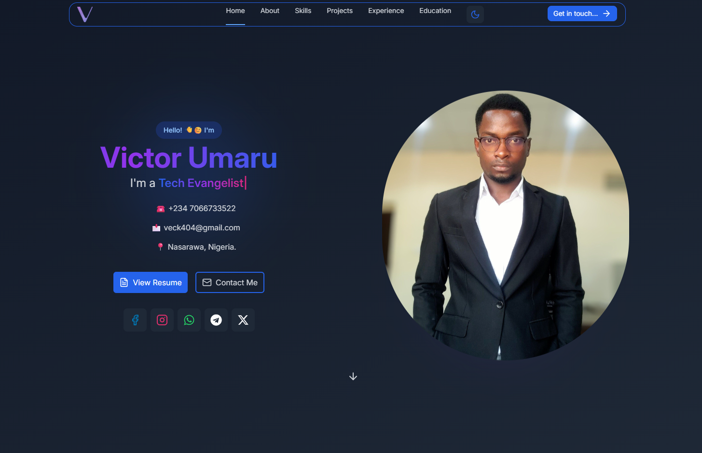
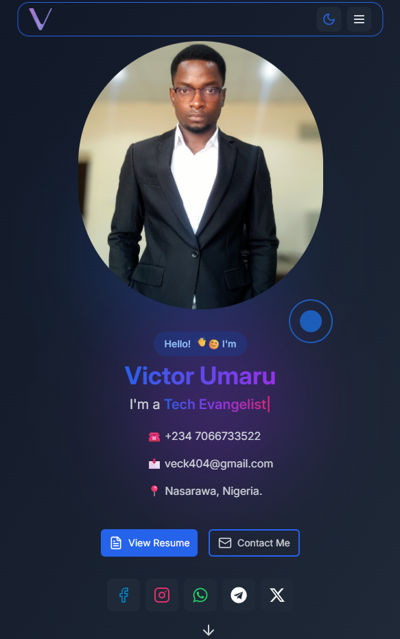

# 🌐 Personal Portfolio – Veck404

This is my personal developer portfolio built using **React**, **Vite**, and **TailwindCSS**. It showcases my projects, skills, experience in clean code architecture and responsive design.

> 🚀 [Live Site](https://vector404.vercel.app)  
> 📦 [GitHub Repository](https://github.com/veck404/portfolio)

---

## 🛠️ Tech Stack

- ⚛️ **React** – Component-based UI
- ⚡ **Vite** – Super-fast bundler
- 🎨 **TailwindCSS** – Utility-first CSS framework
- 🌐 **Deployed on:** Vercel / GitHub Pages

---

## 📸 Preview




---

## 🚀 Getting Started

To run this project locally:

```bash
# Clone the repository
git clone https://github.com/veck404/portfolio.git
cd portfolio

# Install dependencies
npm install

# Start development server
npm run dev
```
